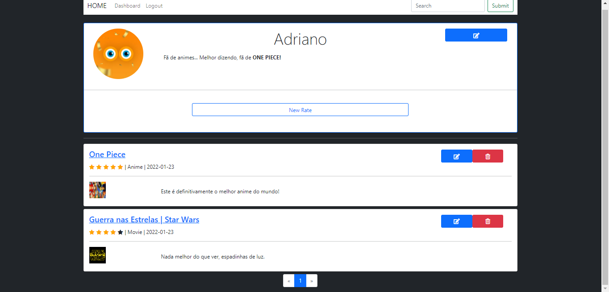
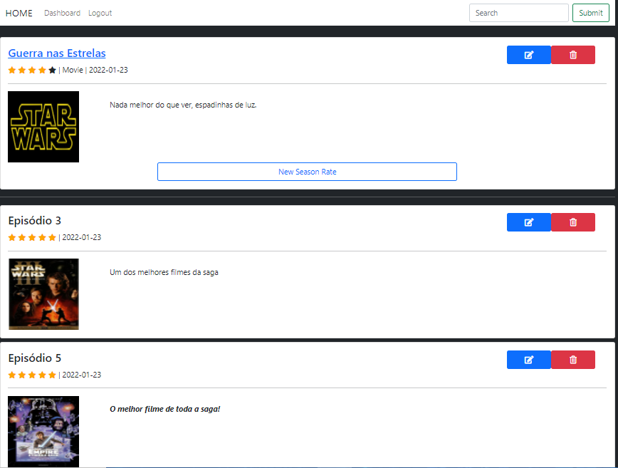
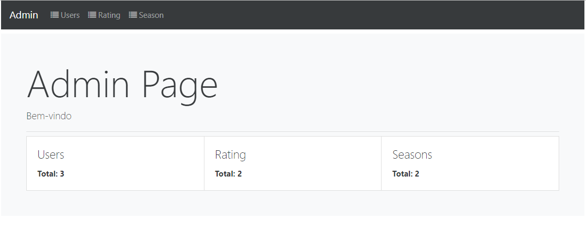

# Flask - Rating Stars

Um site web com sistema de login e de administração. O site funciona como um diário de séries ou filmes, em que permite adicionar avaliações pessoais para cada entretenimento de forma individual, além de poder avaliar cada temporada. 

## 💻 Páginas 

- Páginas principal



- Páginas de temporadas 



- Página inicial da área de administração




********************************************


## 🚀 Começando

Para obter uma cópia deste projeto:

```
git clone https://github.com/adrianomqsmts/ratingstars
cd ratingstars

python -m venv venv
# windows
.\venv\Scripts\activate
# linux
source  venv\bin\activate

pip install -r requirements.txt

cd project
python app.py
```


## 🛠️ Construído com

Ferramentas, linguagens e outras tecnologias usadas no desenvolvimento deste sistema.

* [Visual Studio Code](https://code.visualstudio.com/docs) - Ambiente de Desenvolvimento
* [Git e GitFlow](https://git-scm.com/) - Controle de Versões
* [Bootstrap 4](https://getbootstrap.com/docs/4.0/getting-started/introduction/) - Framework frontend
* [Python](https://docs.python.org/3/) - Backend
* [flask](https://flask.palletsprojects.com/en/2.0.x/) - Framework backend
  * flask-admin
  * flask-login
  * flask-wtf
  * flask-sqlalchemy
  * flask-migrate
  * flask-ckeditor
* ...

## ✒️ Autores

* **Desenvolvedor** - *Código e Documentação* - [Adriano](https://github.com/adrianomqsmts)

